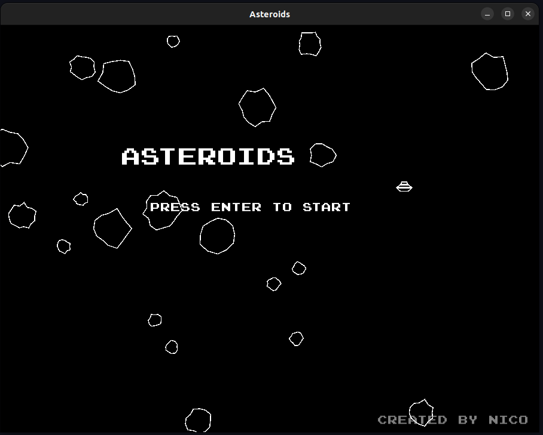
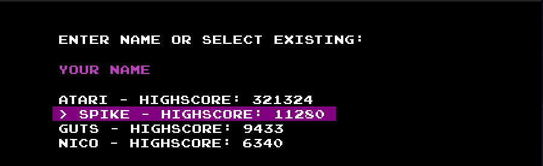
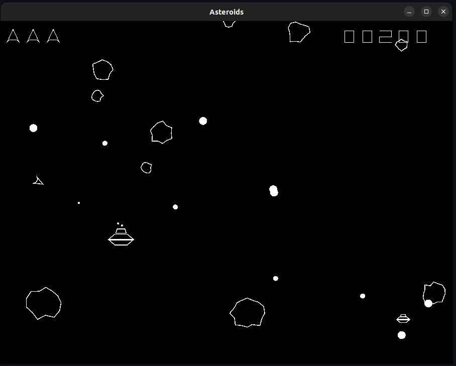
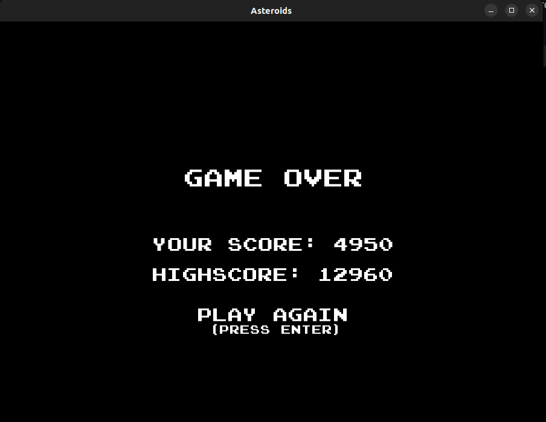

# Asteroids Clone in C++

This project is my own version of the classic arcade game Asteroids, 
implemented in C++ using the SFML library. Experience the nostalgia 
of dodging and shooting asteroids in space and avoiding alien UFOs!



### Choose Your Name
Before starting the game, you can now enter a name or select an 
existing one from the list.


*Choose your name and make it to the top of the leaderboard!*

### Highscores
Compete against yourself or friends by beating highscores! Each name has 
its own highscore, making it fun to try and top the leaderboard.

## Gameplay 

Experience intense asteroid dodging and shooting action.
Navigate through fields of asteroids and fight off alien 
invaders to achieve high scores!


*The Picture does not do the game justice!*

## Game Over 

Don't let the asteroids hit you! If you get hit, it's game over!


*Don't worry you can always try again!*

## Controls

The game is playable with both the keyboard and a
Controller, offering a flexible arcade experience.

### Keyboard Controls:

- **Arrow Keys or A W D:** Move and Rotate the spaceship
- **Space:** Shoot
- **Enter:** Start the game
- **P:** Pause the game
- **Esc:** Exit the game

### Controller Controls:

*Only for PS4 Controller right now.*

- **Left Stick:** Rotate the spaceship
- **X Button:** Shoot
- **R2 Button:** Accelerate the spaceship

### Choosing/Creating a Name:

- **Arrow Keys:** Navigate through the existing names list.
- **Enter:** Select the highlighted name to start the game.
- **Alt:** Save a new name to the list (after typing it).

## Running the Game

Clone the repository and build the game using CMake. Ensure you have the SFML library installed on your system.

```bash
git clone https://github.com/yourusername/asteroids-clone.git
cd asteroids-clone
mkdir build && cd build
cmake ..
make
./Asteroids
```

*Will be a downloadable game soon!*

### Note

This is my first C++ project, built from scratch and aimed at learning the language. Thanks for playing^^